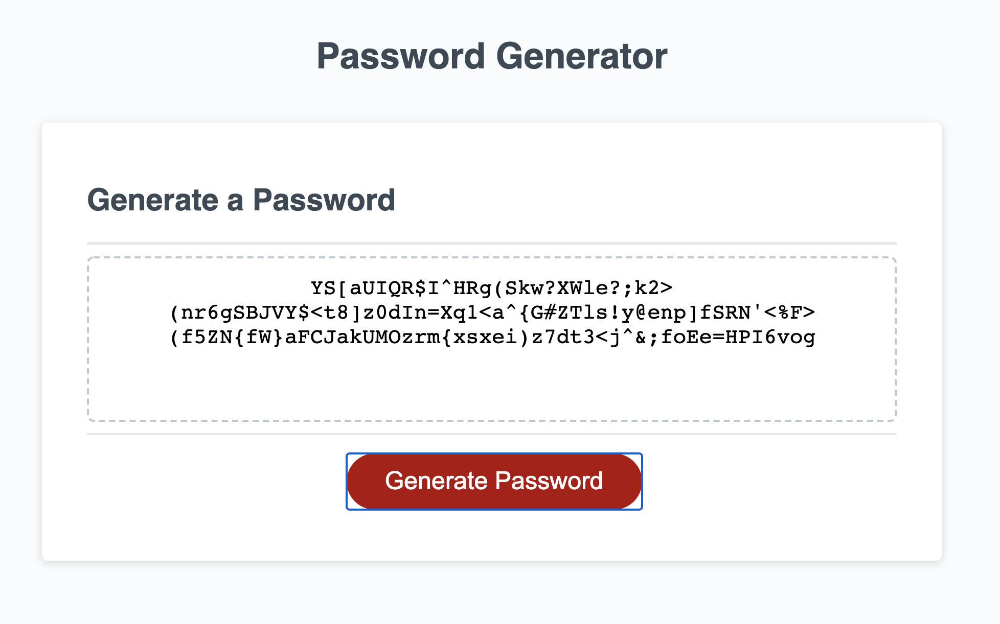

# Password Generator

Generate a random passwords based on the user's specifications. 

When the button "Generate Password" is pressed a prompt box asks the user for the following criteria:

1. The length of the password. This must be a number between 8 - 128. If anything other than a number between 8 - 128 is entered the program will ask again for an entry. 

2. To use Lower Case letters. This will be a "Cancel" for no and an "OK" for yes. 

3. To use Upper Case letters. This will be a "Cancel" for no and an "OK" for yes. 

4. To use numerical characters. This will be a "Cancel" for no and an "OK" for yes. 

5. To use special characters letters. This will be a "Cancel" for no and an "OK" for yes. 

Once these are all selected, the program will spit out a password. 

[Link to Repo](https://github.com/hamzsait/PasswordGenerator)

[Link to Website](https://hamzsait.github.io/PasswordGenerator/)

